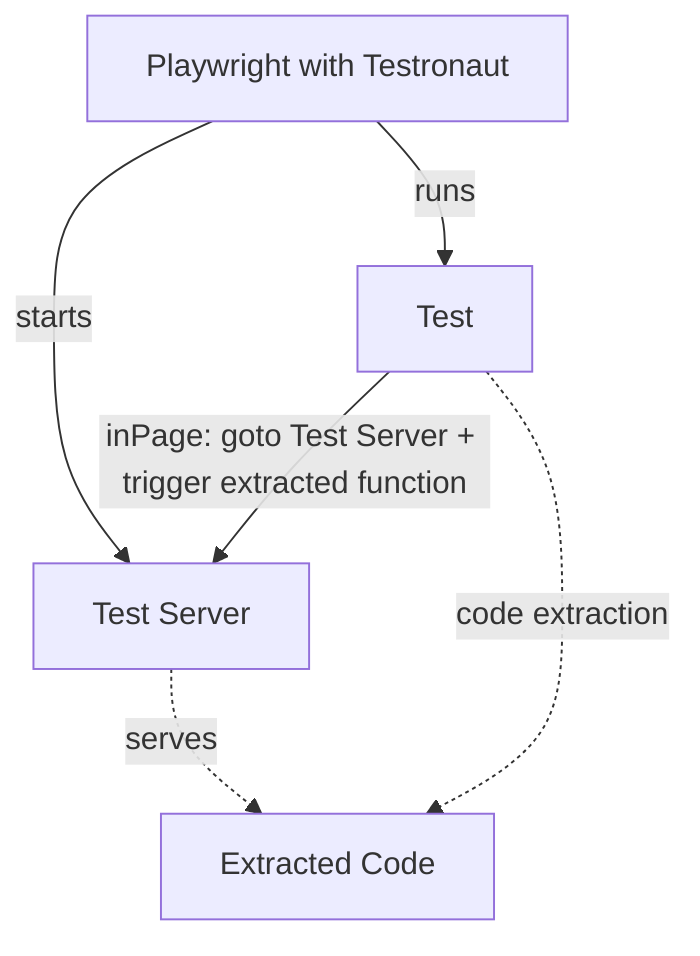
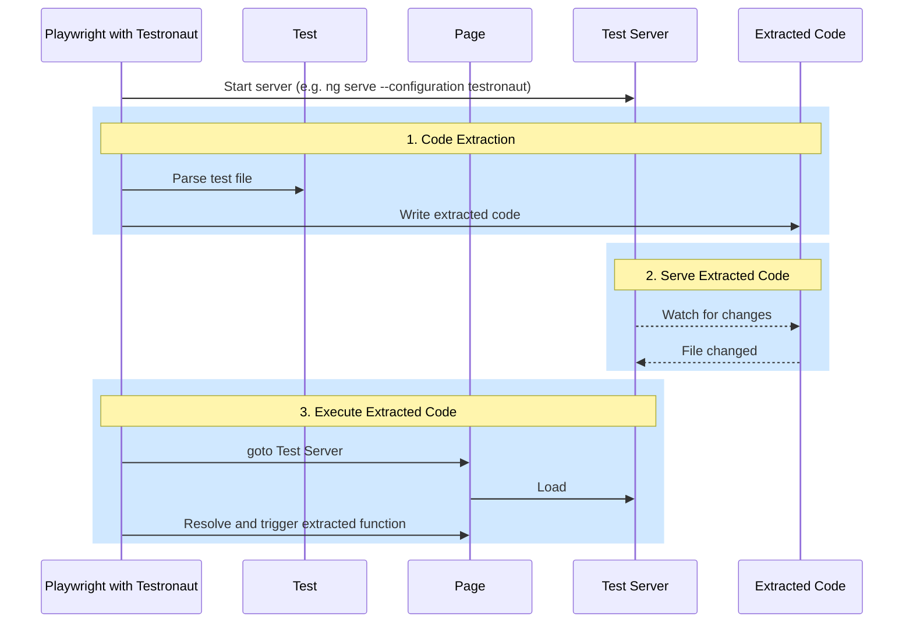

# How It Works

## Big Picture



Playwright tests run in Node.js, but component code — like `mount(SpaceshipLauncher)` — must execute inside a real browser. Testronaut bridges this gap without requiring you to manage a separate app or write duplicated setup code.

The idea behind Testronaut is as follows: Testronaut **extracts** the browser-side code from your test file whenever needed, bundles it into a generated entry point, and **serves** it through a Test Server that your existing dev toolchain already knows how to build. At runtime, when `inPage()` is called, Playwright simply asks the browser to invoke the pre-extracted function by its hash — no serialization magic, no eval, just a regular module import.

This means:

- Your **test file stays the source of truth** for both test logic and component setup.
- The Test Server is your own dev server — Angular CLI, Vite, whatever you use — so **plugins, aliases, and all your build config work out of the box**.
- Code executed using `inPage` runs in the browser and has full access to your app's context, exactly as in production.

## Under the Fuselage



### 1. Code Extraction

Whenever a test uses the `inPage` fixture, Testronaut parses the test file and extracts the code inside `inPage` calls.

```ts title="src/app/spaceship-launcher.pw.ts"
import { expect, test } from '@testronaut/angular';
import { mount } from '@testronaut/angular/browser';
// Extracting `SpaceshipLauncher` because it is used in `inPage`.
// highlight-next-line
import { SpaceshipLauncher } from './spaceship-launcher';

test('take off', async ({ inPage, page }) => {
  // highlight-next-line
  await inPage(() => mount(SpaceshipLauncher));
  await page.getByRole('button', { name: 'Take off' }).click();
  await expect(page.getByRole('status')).toHaveText('Spaceship launched!');
});
```

The extracted code is then written into a generated folder that is served by the Test Server.

```ts title="testronaut/generated/src/app/spaceship-launcher.pw.ts"
import { mount } from '@testronaut/angular/browser';
// highlight-next-line
import { SpaceshipLauncher } from '../../src/app/spaceship-launcher';
export const extractedFunctionsRecord = {
  // highlight-next-line
  ff0f6904: () => mount(SpaceshipLauncher),
};
```

### 2. Test Server serves Extracted Code

The Test Server is a server that you fully control by providing a command to start it in the Playwright config file.

For instance, an Angular CLI project would use the command below to start a test server that behaves exactly
like the development server, except that it will be served from the `testronaut/generated` folder.

```ts title="playwright-testronaut.config.mts"
export default defineConfig(
  ...
  withTestronautAngular({
    configPath: __filename,
    testServer: {
      // highlight-next-line
      command: 'npm exec ng serve --configuration testronaut --port {port}',
    },
  })
  ...
);
```

Playwright will start the Test Server before running the tests.

:::info
Note that Testronaut picks a unique and predictable port number for each Playwright configuration file, and then provides it as an interpolatable variable so that you can forward it to the Test Server command.
:::

### 3. Execute Extracted Code

During the test execution, the `inPage` function:

- computes the unique hash of the extracted code,
- resolves the right extracted function to execute based on the hash,
- executes the extracted function in the page using [`Page#evaluate`](https://playwright.dev/docs/evaluating).
