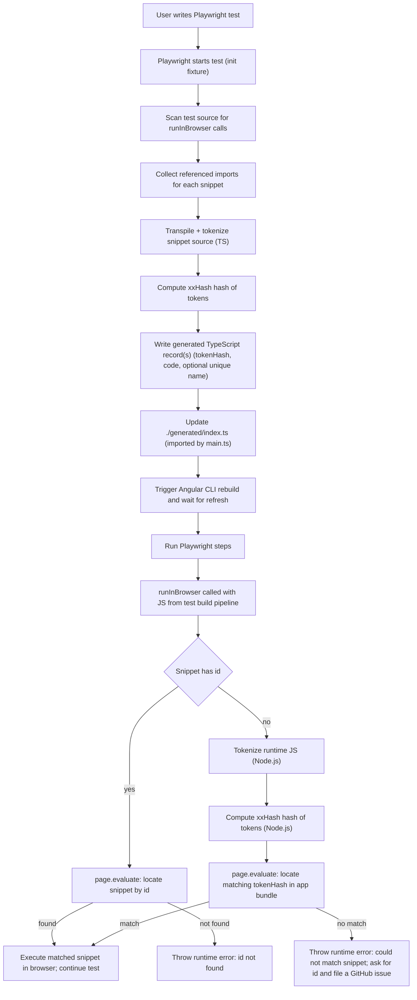

# Code Extraction: Testronaut's Core

### Context / Problem

We extract TypeScript code snippets from `runInBrowser` (Playwright) calls and store them in a separate generated `.ts` file as a data structure. The app’s `main.ts` imports a stable `./generated/index.ts`, and the generator updates that `./generated/index.ts` to reference the latest generated snippets. The Angular CLI then compiles everything to JavaScript.

At runtime, Playwright executes `runInBrowser` by passing code to the browser. By that time, the code is JavaScript emitted by the **test build pipeline** (and may have been normalized/printed differently). Therefore, **the runtime code string is not necessarily byte-identical** to what the Angular CLI emitted into the built JavaScript bundle.

Goal: **match the runtime snippet to the corresponding snippet in the Angular-produced JavaScript output**.

### Why the code can differ

Different toolchains/stages can change the emitted JavaScript even if semantics are the same:

- **Printing differences**: semicolons, parentheses, whitespace, quote style.
- **Lowering transforms**: `async/await`, optional chaining, nullish coalescing, class fields/private fields.
- **Helper injection**: TS/Babel/esbuild helpers (`__awaiter`, `__decorate`, etc.).
- **Bundling/optimization/minification effects**: identifier renaming, wrapping, reformatting.

### Approaches considered

#### 1) Token hash-based matching (current direction)

- Tokenize the runtime snippet and tokenize the Angular CLI output, then compute xxHash hashes of the token arrays for exact matching.
- Pros:
  - Simpler, cheaper to implement and maintain.
  - Smaller generated files (hash string vs full token arrays).
  - Often sufficient for common `runInBrowser` snippets.
  - Can be validated under real conditions via integration tests.
- Cons:
  - Exact matching only (no tolerance for minor differences).
  - Can break when emitters differ significantly (helpers, downleveling, minification, optional chaining transforms, etc.).

#### 2) Parser/AST-based matching (future option)

- Parse both sides and compare a canonicalized AST (or a hash of it).
- Pros:
  - More robust against printing differences and some emitter noise.
- Cons:
  - Non-trivial: canonicalization must handle downleveling, helper injection, minification, and emitter-specific rewrites.
  - Higher implementation cost; still likely needs an escape hatch for edge cases.

### Proposed strategy (pragmatic DX-first)

- Start with **token-based matching**, without relying on an additional “transpiler normalization” step that strips semicolons (because that could remove user intent).
- Add **integration tests** that run under real conditions (Playwright + Angular CLI build) to measure whether the token approach holds up for known challenging scenarios.
- Users can always provide an explicit **`id`** for `runInBrowser` calls.
  - This avoids matching altogether.
  - Since manual ids are “bad DX”, we only want to require them when the matcher fails.
  - This means we don’t need to cover every edge case—just the major ones.

### Diagram: tokenizer + matching flow

### High-risk constructs to cover with integration tests

These are the patterns most likely to cause mismatches across pipelines:

- `async/await`
- optional chaining `?.`
- nullish coalescing `??`
- class fields / private fields (`#x`)
- decorators (common in Angular context)
- enums / namespaces (if relevant to snippets)
- ASI/parenthesis-sensitive constructs (IIFEs, lines starting with `(`, `[`, `/`, `+`, etc.)

### Token hashing

- Tokens are hashed using **xxHash** (native Node.js bindings) with base64 encoding, truncated to 8 characters.
- **Why xxHash**: Maximum collision resistance with fastest performance (~10-20x faster than SHA-256). Excellent avalanche properties ensure uniform distribution across the 48-bit space (8 characters), minimizing collision probability.
- **Where hashing happens**: Both extraction-time and runtime matching hashing occur in **Node.js** (before `page.evaluate()`), allowing use of native xxHash bindings for maximum performance. No browser-compatible hash library needed.
- Token arrays are serialized via `JSON.stringify()` before hashing to ensure deterministic results.
- This provides exact matching with minimal storage overhead in generated files.

### Acceptance criteria

- Token hash matching should work for the **major/common** snippet shapes in real builds.
- When matching fails, the system should provide an actionable message instructing the user to add an explicit `id` as a fallback.
