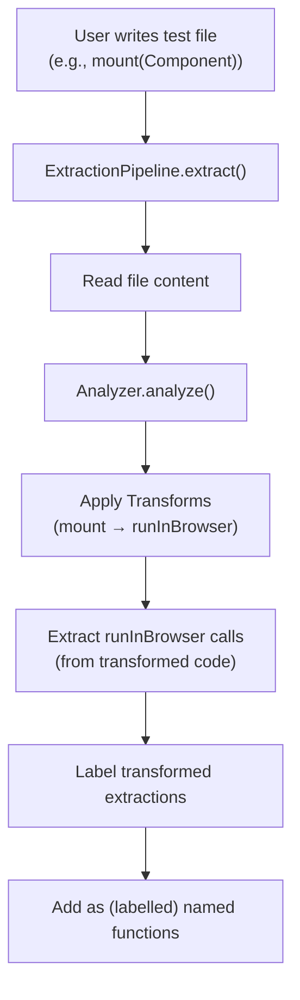

# Transforms in Testronaut

## Overview

Transforms are **utility functions for better DX** that shorten repetitive `runInBrowser()` patterns. The single primitive is `runInBrowser()`, but transforms allow users to write concise, framework-idiomatic code like `mount(Component)` instead of verbose `runInBrowser(() => TestBed.createComponent(Component))`.

Transforms serve two roles:

1. **Runtime**: Provide framework-specific fixtures (e.g., `mount`) that internally call `runInBrowser()`
2. **Extraction**: Transform source code during analysis so framework-specific calls can be extracted as `runInBrowser()` calls

## Why Transforms Exist

Without transforms, users must write repetitive boilerplate:

```typescript
// Without transforms - verbose and repetitive
runInBrowser(() => TestBed.createComponent(TestComponent));
runInBrowser(() => TestBed.createComponent(AnotherComponent));
```

Transforms solve this by:

1. **Shortening patterns**: `mount(TestComponent)` instead of `runInBrowser(() => TestBed.createComponent(TestComponent))`
2. **Providing fixtures**: The `mount` fixture internally calls `runInBrowser` at runtime
3. **Transforming source**: During extraction, transforms convert `mount()` calls to `runInBrowser()` calls

### Two Roles

**Runtime Role** (via fixtures):

- The `mount` fixture is a Playwright fixture that calls `runInBrowser()` internally
- At runtime, `mount(Component)` → `runInBrowser(() => mount(Component))` where `mount` is the framework-specific function

**Extraction Role** (via AST transformation):

- During code extraction, transforms rewrite source code: `mount(Component)` → `runInBrowser(() => mount(Component))`
- The `mount` inside the callback is the **framework-specific function** (e.g., Angular's `TestBed.createComponent`)
- This allows the analyzer to extract the code as a `runInBrowser` call

## Process Flow



1. **Transformation**: Transforms are applied sequentially, converting framework calls to `runInBrowser()` calls
2. **Extraction**: Analyzer extracts `runInBrowser()` calls from transformed code
3. **Labelling**: Marks tranformed `runInBrowser()` as transformed ones.
4. **Generation**: Writes extracted functions to generated TypeScript files
5. **Runtime**: Fixtures call `runInBrowser()` which executes the extracted code

## Transform Contract

```typescript
interface Transform {
  name: string; // e.g., 'angular'
  apply: (fileData: FileData) => TransformResult;
}

interface TransformResult {
  content: string; // Transformed source code
  importedIdentifiers: ImportedIdentifier[]; // Additional imports needed
  generatedNames?: string[]; // Names generated for runInBrowser calls
}
```

### Responsibilities

1. **Code Transformation**: Convert framework calls (e.g., `mount(Component)`) to `runInBrowser(() => mount(Component))` where `mount` is the framework-specific function
2. **Name Generation**: Generate stable names for anonymous `runInBrowser` calls and report them via `generatedNames`
3. **Pass-through `runInBrowser`**: During test execution, the transform fixture internally calls `runInBrowser`

## Name Generation

### Why Generate Names?

Since the test files code (`mount(Component)`) differes from its transformed representation (`runInBrowser(() => TestBed.createComponent(Component))`), anonymous
functions won't work. They depend that both analyzer and fixture create a hash of
the tokens which are the same.

If code differs, those hashes won't match anymore.

By requiring the transformer to generate only named extracted functions, the hashing is not necessary.

There is one constraint, though. The name generated by the transformer will not be
checked for duplications. In case a `mount(Component)` is called several times within
a test file, we only want to have one extracted function.
So the generated name must be **deterministic**: the same function call must always produce the same name, just like a hash function.
