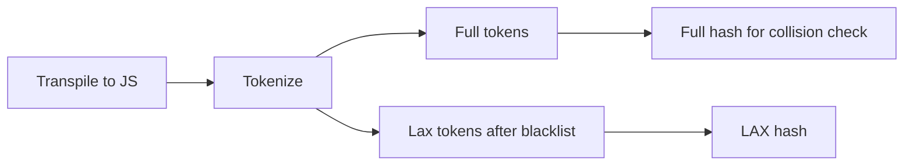
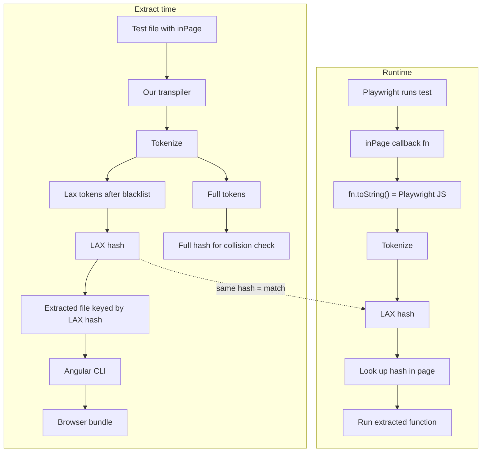

# Lax Hashing — Matching Extracted Functions Across Transpilers

**Status:** Draft. Last updated: 2025-01-31. Changelog: [History](#history).

## Contents

- [Overview and Context](#overview-and-context)
- [Lax Hashing](#lax-hashing)
  - [Pipeline](#pipeline)
  - [Collision Detection](#collision-detection)
  - [String Quotation Handling](#string-quotation-handling)
- [Visualization](#visualization)
- [Risks](#risks)
- [Future Fallback Strategies](#future-fallback-strategies)
- [Considered and Used Alternatives](#considered-and-used-alternatives)
- [Glossary](#glossary)
- [History](#history)

## Overview and Context

Per test file, Testronaut extracts functions from `inPage(...)` calls into a separate file. The Angular CLI [transpiles](#transpiler) that separate file. During test execution, Playwright transpiles the same function inside `inPage` as well.

> The challenge is to match the same function across its two transpiled versions (extract-time and Playwright at runtime).

Users can add a unique name to an `inPage` function. We call the function **named function**. Testronaut matches that function in the browser safely via the name.

Without a unique name, the function is called an **anonymous function** and matching is based on the code itself.

Because of better DX, users prefer anonymous over named functions.

Transpilers often emit **syntactically different but equivalent** JS (commas, parens, formatting). So an exact matching algorithm based on tokens or just string equal very likely fails.

**Example:**

Let's take the following code `(message: string) => console.log(message);`. Playwright and Angular CLI could transpile into the following, slightly different versions.

1.  `message => console.log('Hello world');`
2.  `(message) => console.log('Hello world')`.

The first version misses the parentheses from `(message)` to `message`. The second misses the `;` at the end of the line. A string-based match would therefore fail.

## Lax Hashing

Testronaut's solution is called "Lax Hashing" which is based on an approximation with an integrated collision detection.

In a nutshell, LAX adds a hash to each anonymous function, effectively making it a named function. The hash is computed from the transpiled code (at extract-time and at runtime from Playwright), so we match the two transpiled versions via their hash, not by comparing directly to Angular's output. See [Visualization](#visualization) for a diagram of the pipeline.

### Pipeline

With Lax Hashing, Testronaut transpiles (third time, next to Playwright & Angular) and tokenizes the original function. It removes known tokens which a transpiler could add or remove. We therefore end up with tokens which a transpiler will always keep. Based on that subset of tokens, we generate a hash, which we call "Lax Hash" (from relaxed hash).

The following characters will be removed: `(`, `)`, `,`, `;`.

**Example:**

1. `(message: string) => console.log(message);` gets transpiled into `(message) => console.log(message);`
2. The tokenizer produces the full tokens as an array: `['(', 'message', ')', '=>' 'console', '.', 'log', '(', 'message', ')', ';']`.
3. The lax hashing would remove character like parenthesis, commas and semi-colons. So we end up with a lax token array of `['message', '=>', 'console', '.', 'log', 'message']`.
4. Via the xxhash that laxed string array becomes the actual Lax Hash

### Collision Detection

If we apply the lax hashing to both Playwright's transpiled code and the original source code, we should have a guaranteed match in theory.

The problem is that removed tokens have a semantic meaning and we could end up matching two functions with different meaning.

Collision detection will ensure a safe match of extracted functions.

Testronaut applies the lax hashing to each `inPage` with an anonymous function. With each run, it checks if the same lax hash for that file was already generated. If that's the case, then it verifies the existing hash of the full tokens with the full token hash of the current function. If both full hashes are the same, it has to be the same function and the current one is skipped.

In case we have the lax hash but two different full hashes, then functions COULD be different. In that case, Testronaut plays it safe and throws an error, telling the user which functions collided and to apply a named function instead.

Additionally, Testronaut also asks the user to create an issue on Testronaut's GitHub repo for further investigation.

Quotes are handled by the tokenizer: string literals are normalized to a canonical form (see **String Quotation Handling** below), so `'hi'`, `"hi"`, and `` `hi` `` produce the same token value and the same LAX hash — avoiding false negatives when different transpilers use different quote styles. Different string _contents_ (e.g. `'Hello "World"'` vs `"Hello 'World'"`) still produce different token values and different lax hashes.

**Example:**

Given the following distinct semantically different `inPage` calls:

- `inPage(() => (message) => console.log(message()))`
- `inPage(() => (message) => console.log(message))`

Both would produce the same lax tokens: `['message', '=>', 'console', '.', 'log', 'message']`.

Since the same lax hash exists multiple times, Testronaut starts the collision detection, that calculates the full token hash. Those will be different for both functions, and Testronaut will throw an error.

For the sake of completeness, here are the full tokens for both functions:

- `['(', 'message', ')', '=>', 'console', '.', 'log', '(', 'message', '(', ')', ')']`
- `['(', 'message', ')', '=>', 'console', '.', 'log', '(', 'message', ')']`

### String Quotation Handling

Since strings can contain different delimiter characters (`'`, `"`, `` ` ``), they have to be unified as well.

The tokenizer normalizes them to a canonical form, by not keeping the delimiter character of the source code but always uses a single quote delimiter.

We cannot put string quotes to the exclude list, because we would have a collision with string literals and variable names, i.e. `console.log('message')` and `console.log(message)`.

## Visualization

## Risks

At the moment, Lax hashing hasn't been used for a wide range of code. We will need to be aware of potential risks which users will face and hopefully report. Concrete risks (optional chaining tokenization, template literals with `${ }` spacing, comment handling) will be identified during implementation and testing.

That is also why, Testronaut provides a copy & paste ready error message, which the user can use to create an issue on Testronaut's GitHub repo.

## Future Fallback Strategies

In case we encounter issues, which are not covered by Lax hashing, we will need to fall back to a more expensive technique.

A promising option would be using a tool, which re-creates JavaScript from any transpiled code. That would mean that we always have the same JavaScript code, regardless of the transpiler used.

Since this is an expensive operation, it would only be used in collision with Lax hashing. So Lax Hashing would still be the primary matching strategy.

## Considered and Used Alternatives

### Full-Token

Doing just the transpilation and tokenization, with comparing the full tokens of the original source code and the transpiled code does not work, because of the differences in the transpiled code.

Therefore, we tried to cover common cases, like trailing commas, semi-colons or no parenthesis for functions with only one argument.

We found though, that this strategy would lead us to a catching-up game, where we would need to always update the matching strategy to cover the new transpiler features.

Especially, since Testronaut is new, we wouldn't be aware of all potential risks and users would get the impression, that Testronaut is not working.

### AST Parsing

AST parsing was the suggested approach by various AI tools, but they all highlighted the complexity of the approach, the longer implementation along maintenance costs, not even talking about the bad performance implications.

### ESLint

ESLint is a very powerful tool, which could definitely help to verify if functions are "matchable'. We didn't really follow this approach, because we don't want to enforce the usage of ESLint for our users.

### Single Anonymous Function per File

The single anonymous function per file, turned that anonymous function into a named function with name empty string.

Very soon, it turned out that this is not a very user friendly approach and could become the main obstacle for users to adopt Testronaut.

## Glossary

- **Transpiler** — A subtype of a compiler which compiles from one language to another. In this case from TypeScript to JavaScript.
- **LAX hash** — Hash computed from the lax token stream (full tokens after blacklisting `(`, `)`, `,`, `;`). Used as the stable key for an anonymous function at extract time and at runtime.
- **Full hash** — Hash of the full token stream (no blacklist). Used only for collision detection; same LAX hash + different full hash ⇒ error.
- **Named function** — `inPage` callback with a user-supplied name; matched in the browser by that name, not by LAX hash.
- **Anonymous function** — `inPage` callback without a name; matched by LAX hash.

## History

- _Draft._ Spec created; LAX pipeline and tokenizer not yet implemented.
