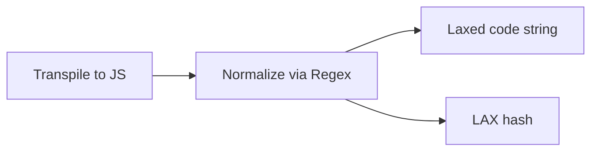
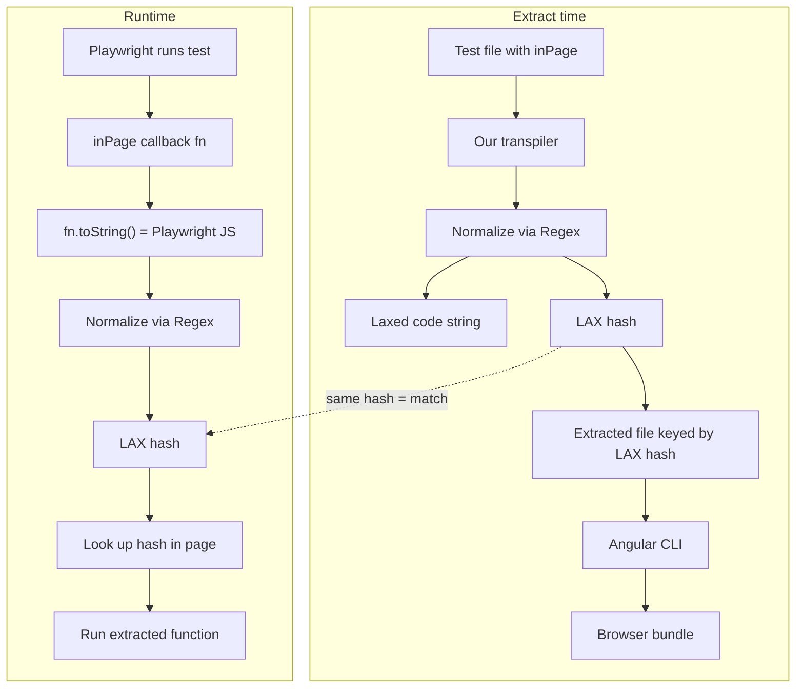

# Lax Hashing — Matching Extracted Functions Across Transpilers

## Contents

- [Overview and Context](#overview-and-context)
- [Lax Hashing](#lax-hashing)
  - [Pipeline](#pipeline)
  - [Collision Detection](#collision-detection)
  - [Key Format (Named vs Anonymous)](#key-format-named-vs-anonymous)
  - [String Quotation Handling](#string-quotation-handling)
- [Visualization](#visualization)
- [Risks](#risks)
- [Future Fallback Strategies](#future-fallback-strategies)
- [Considered and Used Alternatives](#considered-and-used-alternatives)
- [Glossary](#glossary)
- [History](#history)

## Overview and Context

Per test file, Testronaut extracts functions from `inPage(...)` calls into a separate file. The Angular CLI [transpiles](#transpiler) that separate file. During test execution, Playwright transpiles the same function inside `inPage` as well.

> The challenge is to match the same function across its two transpiled versions (extract-time and Playwright at runtime).

Users can add a unique name to an `inPage` function. We call the function **named function**. Testronaut matches that function in the browser safely via the name.

Without a unique name, the function is called an **anonymous function** and matching is based on the code itself.

Because of better DX, users prefer anonymous over named functions.

Transpilers often emit **syntactically different** JS (commas, parens, formatting). So an exact matching algorithm based on tokens or just string equal very likely fails.

**Example:**

Let's take the following code `(message: string) => console.log(message);`. Playwright and Angular CLI could transpile into the following, slightly different versions.

1. `message => console.log('Hello world');`
2. `(message) => console.log('Hello world')`.

The first version misses the parentheses from `(message)` to `message`. The second misses the `;` at the end of the line. A string-based match would therefore fail.

## Lax Hashing

Testronaut's solution is called "Lax Hashing" which is based on an approximation with an integrated collision detection.

In a nutshell, LAX adds a hash to each anonymous function, effectively making it a named function. The hash is computed from the transpiled code (at extract-time and at runtime from Playwright), so we match the two transpiled versions via their hash, not by comparing directly to Angular's output. The normalized "laxed" string is intentionally not a semantics-preserving representation of the original JavaScript. See [Visualization](#visualization) for a diagram of the pipeline.

### Pipeline

With Lax Hashing, Testronaut transpiles (third time, next to Playwright & Angular) the original function to JavaScript. It then applies a series of regex replacements to "normalize" the code, removing syntax which a transpiler could add or remove. Based on that normalized string, we generate a hash, which we call "Lax Hash" (from relaxed hash). The goal is cross-transpiler stability, not preservation of the exact meaning of the original JavaScript source string.


```mermaid
flowchart LR
  A[Transpile to JS] --> B[Normalize via Regex]
  B --> C[Laxed code string]
  B --> D[LAX hash]
```


The normalization applies the following rules:

1. **Remove all whitespace** (`\s`).
2. **Remove all semicolons** (`;`).
3. **Normalize all quotes** to single quotes (`'`).
4. **Remove isolated parentheses** ( `(` and `)` ), but **preserve empty parentheses** (`()`) so some important syntactic differences still survive normalization.

**Example:**

1. `(message: string) => console.log(message);` gets transpiled into `(message) => console.log(message);`
2. The regex normalization produces the laxed string: `message=>console.logmessage`.
3. Via the xxhash that laxed string becomes the actual Lax Hash.

### Collision Detection

If we apply the lax hashing to both Playwright's transpiled code and the original source code, we should get the same key for the same snippet across transpilers.

The problem is that removed characters can carry meaning, so two different JavaScript snippets can collapse to the same laxed string.

Collision detection ensures that matching stays safe at the file level.

Testronaut applies the lax hashing to each anonymous `inPage` callback in a file. If the same lax hash appears again, we compare the hash of the raw transpiled JavaScript as a tie-breaker.

If the repeated callback has the same transpiled JavaScript, Testronaut accepts it and continues. If the same lax hash maps to different transpiled JavaScript, Testronaut plays it safe and throws an error, telling the user which functions collided and to apply a named function instead.

Additionally, Testronaut also asks the user to create an issue on Testronaut's GitHub repo for further investigation.

Quotes are handled by the normalization: string literals are normalized to a canonical form (all `'`, `"`, and ``` become `'`), so `'hi'`, `"hi"`, and ``hi`` produce the same laxed string, avoiding false negatives when different transpilers use different quote styles.

**Example:**

Given the following distinct `inPage` calls:

- `inPage(() => (message) => console.log(message()))`
- `inPage(() => (message) => console.log(message))`

Both would produce the same laxed string if parentheses were removed blindly. However, by preserving `()`, they remain distinct:

- `message=>console.logmessage()`
- `message=>console.logmessage`

Since the lax strings are different, they produce different lax hashes and match correctly.

### Key Format (Named vs Anonymous)

The `extractedFunctionsRecord` stores both named and anonymous functions. Lax hashes have a prefix of `__lax__`. Named functions use the user-provided name as-is. To keep the key spaces disjoint, `inPageWithNamedFunction` rejects names that start with the `__lax__` prefix (at extract time and at runtime).

## Visualization


```mermaid
flowchart TB
  subgraph extract [Extract time]
    A1[Test file with inPage]
    A2[Our transpiler]
    A3[Normalize via Regex]
    A4[Laxed code string]
    A6[LAX hash]
    A8[Extracted file keyed by LAX hash]
    A9[Angular CLI]
    A10[Browser bundle]
    A1 --> A2 --> A3 --> A4
    A3 --> A6
    A6 --> A8 --> A9 --> A10
  end

  subgraph runtime [Runtime]
    B1[Playwright runs test]
    B2[inPage callback fn]
    B3["fn.toString() = Playwright JS"]
    B4[Normalize via Regex]
  B5[LAX hash]
    B6[Look up hash in page]
    B7[Run extracted function]
    B1 --> B2 --> B3 --> B4 --> B5 --> B6 --> B7
  end

  A6 -.->|"same hash = match"| B5
```


## Risks

At the moment, Lax hashing hasn't been used for a wide range of code. We will need to be aware of potential risks which users will face and hopefully report. Concrete risks (optional chaining tokenization, template literals with `${ }` spacing, comment handling, same lax hash with different transpiled output) will be identified during implementation and testing.

That is also why, Testronaut provides a copy & paste ready error message, which the user can use to create an issue on Testronaut's GitHub repo.

## Future Fallback Strategies

In case we encounter issues, which are not covered by Lax hashing, we will need to fall back to a more expensive technique.

A promising option would be using a tool, which re-creates JavaScript from any transpiled code. That would mean that we always have the same JavaScript code, regardless of the transpiler used.

Since this is an expensive operation, it would only be used in collision with Lax hashing. So Lax Hashing would still be the primary matching strategy.

## Considered and Used Alternatives

### Full-Token

Doing just the transpilation and tokenization, with comparing the full tokens of the original source code and the transpiled code does not work, because of the differences in the transpiled code.

Therefore, we tried to cover common cases, like trailing commas, semi-colons or no parenthesis for functions with only one argument.

We found though, that this strategy would lead us to a catching-up game, where we would need to always update the matching strategy to cover the new transpiler features.

Especially, since Testronaut is new, we wouldn't be aware of all potential risks and users would get the impression, that Testronaut is not working.

### AST Parsing

AST parsing was the suggested approach by various AI tools, but they all highlighted the complexity of the approach, the longer implementation along maintenance costs, not even talking about the bad performance implications.

### ESLint

ESLint is a very powerful tool, which could definitely help to verify if functions are "matchable'. We didn't really follow this approach, because we don't want to enforce the usage of ESLint for our users.

### Single Anonymous Function per File

The single anonymous function per file, turned that anonymous function into a named function with name empty string.

Very soon, it turned out that this is not a very user friendly approach and could become the main obstacle for users to adopt Testronaut.

## Glossary

- **Transpiler** — A subtype of a compiler which compiles from one language to another. In this case from TypeScript to JavaScript.
- **LAX hash** — Hash computed from the regex-normalized code string (no whitespace, no semicolons, normalized quotes, removed isolated parens). Lax hashes have a prefix of `__lax__`. Used as the stable key for an anonymous function at extract time and at runtime.
- **LAX key** — `__lax__` prefix + LAX hash; the value used as the key in `extractedFunctionsRecord`. It is required to ensure that users cannot use names which are reserved for anonymous functions.
- **Full hash** — Hash of the raw transpiled JavaScript (no normalization). Used only for collision detection; same LAX hash + different full hash ⇒ error.
- **Named function** — `inPage` callback with a user-supplied name; matched in the browser by that name, not by LAX hash. Names must not start with the `__lax__` prefix.
- **Anonymous function** — `inPage` callback without a name; matched by LAX key (`__lax__` prefix + hash).

## History

- *Draft.* Spec created; LAX pipeline and tokenizer not yet implemented.
- *Regex-based.* Switched from tokenizer to regex-based normalization for performance and simplicity.

