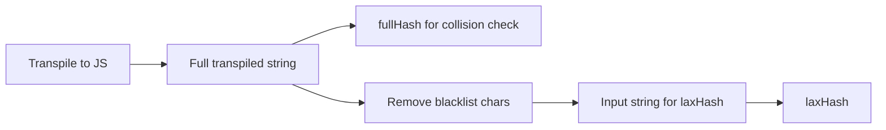
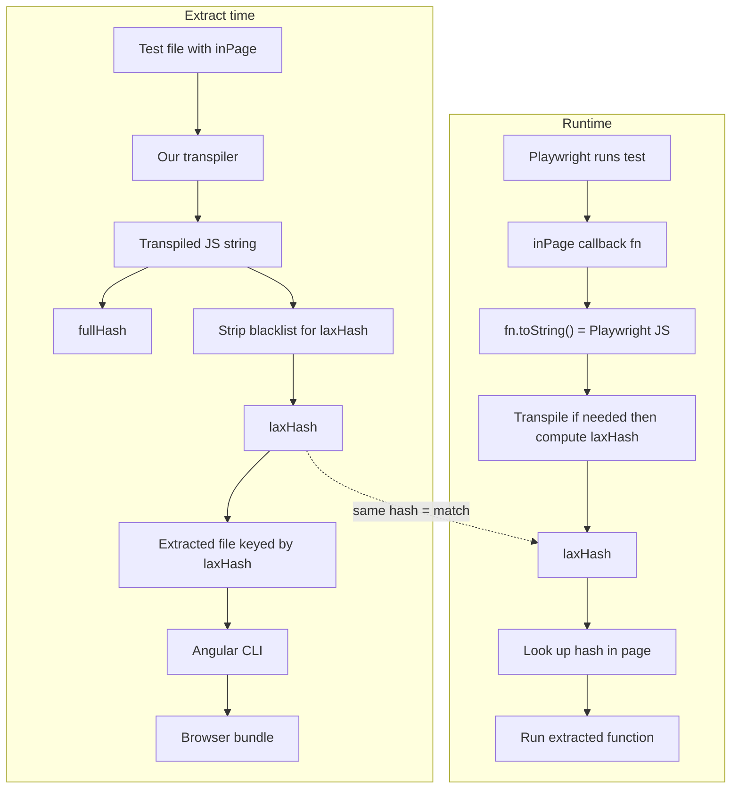

# Lax Hashing — Matching Extracted Functions Across Transpilers

## Contents

- [Overview and Context](#overview-and-context)
- [Lax Hashing](#lax-hashing)
  - [Pipeline](#pipeline)
  - [Collision Detection](#collision-detection)
  - [Key Format (Named vs Anonymous)](#key-format-named-vs-anonymous)
  - [String Quotation Handling](#string-quotation-handling)
- [Visualization](#visualization)
- [Risks](#risks)
- [Future Fallback Strategies](#future-fallback-strategies)
- [Considered and Used Alternatives](#considered-and-used-alternatives)
- [Glossary](#glossary)
- [History](#history)

## Overview and Context

Per test file, Testronaut extracts functions from `inPage(...)` calls into a separate file. The Angular CLI [transpiles](#transpiler) that separate file. During test execution, Playwright transpiles the same function inside `inPage` as well.

> The challenge is to match the same function across its two transpiled versions (extract-time and Playwright at runtime).

Users can add a unique name to an `inPage` function. We call the function **named function**. Testronaut matches that function in the browser safely via the name.

Without a unique name, the function is called an **anonymous function** and matching is based on the code itself.

Because of better DX, users prefer anonymous over named functions.

Transpilers often emit **syntactically different but equivalent** JS (commas, parens, formatting). So an exact matching algorithm based on tokens or just string equal very likely fails.

**Example:**

Let's take the following code `(message: string) => console.log(message);`. Playwright and Angular CLI could transpile into the following, slightly different versions.

1.  `message => console.log('Hello world');`
2.  `(message) => console.log('Hello world')`.

The first version misses the parentheses from `(message)` to `message`. The second misses the `;` at the end of the line. A string-based match would therefore fail.

## Lax Hashing

Testronaut's solution is called "Lax Hashing" which is based on an approximation with an integrated collision detection.

In a nutshell, LAX adds a hash to each anonymous function, effectively making it a named function. The hash is computed from the transpiled code (at extract-time and at runtime from Playwright), so we match the two transpiled versions via their hash, not by comparing directly to Angular's output. See [Visualization](#visualization) for a diagram of the pipeline.

### Pipeline

With Lax Hashing, Testronaut transpiles (third time, next to Playwright & Angular) the original function. It removes characters -via simple regular expressions - which are known to be added or removed by different transpilers. Based on what's left, it computes the hash, which we call the lax hash.

In that case, laxHash is a best-effort approach and can be seen as a fingerprint. We accept that semantically different functions could result in the same hash, but those will still be detected via the collision check and the hashes's scope are only for the testing file.

```mermaid
flowchart LR
  A[Transpile to JS] --> B[Full transpiled string]
  B --> C[fullHash for collision check]
  B --> D[Remove blacklist chars]
  D --> E[Input string for laxHash]
  E --> F[laxHash]
```

The following characters are removed for **`laxHash`**: `(`, `)`, `,`, `;`, `'`, `"`, `` ` ``.

**Example:**

1. `(message: string) => console.log(message);` gets transpiled into `(message) => console.log(message);`.
2. After removing the blacklist characters from that string, the intermediate text used for **`laxHash`** is conceptually: `message => console.logmessage` (parentheses around arguments and call are gone; it is not meant to be readable JS).
3. That string is passed to xxhash; the hex digest becomes **`laxHash`** (with `__lax__` prefix).

### Collision Detection

If we apply the lax hashing to both Playwright's transpiled code and the original source code, we should have a guaranteed match in theory.

The problem is that removed characters still have semantic meaning in the real language, and we could end up matching two functions with different meaning.

Collision detection will ensure a safe match of extracted functions.

Testronaut applies the lax hashing to each `inPage` with an anonymous function. With each run, it checks if the same lax hash for that file was already generated. If that's the case, then it verifies the existing **`fullHash`** (hash of the full transpiled string) with the **`fullHash`** of the current function. If both **`fullHash`** values are the same, it has to be the same function and the current one is skipped.

In case we have the lax hash but two different **`fullHash`** values, then functions COULD be different. In that case, Testronaut plays it safe and throws an error, telling the user which functions collided and to apply a named function instead.

Additionally, Testronaut also asks the user to create an issue on Testronaut's GitHub repo for further investigation.

**Example:**

Given the following distinct semantically different `inPage` calls:

- `inPage(() => (message) => console.log(message()))`
- `inPage(() => (message) => console.log(message))`

Both can produce the same **`laxHash`** input after blacklist removal on each transpiled body. Their **full** transpiled strings still differ (e.g. extra `()` around `message` in the call), so **`fullHash`** differs and Testronaut throws a collision error instead of merging them.

### Key Format (Named vs Anonymous)

The `extractedFunctionsRecord` stores both named and anonymous functions. Lax hashes have a prefix of `__lax__`. Named functions use the user-provided name as-is. To keep the key spaces disjoint, `inPageWithNamedFunction` rejects names that start with the `__lax__` prefix (at extract time and at runtime).

### String Quotation Handling

Since strings can contain different delimiter characters (`'`, `"`, `` ` ``), they have to be unified for **`laxHash`** as well.

Those delimiter characters are on the **same blacklist** as `(`, `)`, `,`, and `;`: they are stripped from the transpiled text before hashing **`laxHash`**, so e.g. `console.log('hi')` and `console.log("hi")` tend toward the same lax input—**higher chance** extract-time and Playwright agree when only quote style differs.

We accept that global stripping can make **`laxHash`** inputs look alike for different code (e.g. `console.log('message')` vs `console.log(message)`); the **full** transpiled strings still differ, so **`fullHash`** distinguishes them **within the same file** and triggers a collision error instead of merging two different anonymous bodies. **Template literals** and escapes can still interact oddly with a text-global strip; that is a known heuristic risk.

## Visualization

```mermaid
flowchart TB
  subgraph extract [Extract time]
    A1[Test file with inPage]
    A2[Our transpiler]
    A3[Transpiled JS string]
    A4[fullHash]
    A5[Strip blacklist for laxHash]
    A6[laxHash]
    A7[Extracted file keyed by laxHash]
    A8[Angular CLI]
    A9[Browser bundle]
    A1 --> A2 --> A3
    A3 --> A4
    A3 --> A5 --> A6
    A6 --> A7 --> A8 --> A9
  end

  subgraph runtime [Runtime]
    B1[Playwright runs test]
    B2[inPage callback fn]
    B3["fn.toString() = Playwright JS"]
    B4[Transpile if needed then compute laxHash]
    B5[laxHash]
    B6[Look up hash in page]
    B7[Run extracted function]
    B1 --> B2 --> B3 --> B4 --> B5 --> B6 --> B7
  end

  A6 -.->|"same hash = match"| B5
```

## Risks

At the moment, Lax hashing hasn't been used for a wide range of code. We will need to be aware of potential risks which users will face and hopefully report. Concrete risks (optional chaining tokenization, template literals with `${ }` spacing, comment handling) will be identified during implementation and testing.

That is also why, Testronaut provides a copy & paste ready error message, which the user can use to create an issue on Testronaut's GitHub repo.

## Future Fallback Strategies

In case we encounter issues, which are not covered by Lax hashing, we will need to fall back to a more expensive technique.

A promising option would be using a tool, which re-creates JavaScript from any transpiled code. That would mean that we always have the same JavaScript code, regardless of the transpiler used.

Since this is an expensive operation, it would only be used in collision with Lax hashing. So Lax Hashing would still be the primary matching strategy.

## Considered and Used Alternatives

### Full-Token

Doing just the transpilation and tokenization, with comparing the full tokens of the original source code and the transpiled code does not work, because of the differences in the transpiled code.

Therefore, we tried to cover common cases, like trailing commas, semi-colons or no parenthesis for functions with only one argument.

We found though, that this strategy would lead us to a catching-up game, where we would need to always update the matching strategy to cover the new transpiler features.

Especially, since Testronaut is new, we wouldn't be aware of all potential risks and users would get the impression, that Testronaut is not working.

### Tokenizer-based LAX (TypeScript scanner)

An earlier implementation tokenized transpiled JS, dropped blacklist **tokens**, and hashed token arrays — plus canonical string literal forms for quoting. That improved some cross-transpiler cases but added an additional dependency.

### Full-token equality only

Comparing only full token streams between two transpiled bodies still diverges too often; the relaxed (LAX) layer is still required.

### AST Parsing

AST parsing was the suggested approach by various AI tools, but they all highlighted the complexity of the approach, the longer implementation along maintenance costs, not even talking about the bad performance implications.

### ESLint

ESLint is a very powerful tool, which could definitely help to verify if functions are "matchable'. We didn't really follow this approach, because we don't want to enforce the usage of ESLint for our users.

### Single Anonymous Function per File

The single anonymous function per file, turned that anonymous function into a named function with name empty string.

Very soon, it turned out that this is not a very user friendly approach and could become the main obstacle for users to adopt Testronaut.

## Glossary

- **<a id="transpiler">Transpiler</a>** — A subtype of a compiler which compiles from one language to another. In this case from TypeScript to JavaScript.
- **LAX hash** — Hash computed from the transpiled JS string after removing `(`, `)`, `,`, `;`, `'`, `"`, `` ` `` everywhere (input to **`laxHash`**). Lax hashes have a prefix of `__lax__`. Used as the stable key for an anonymous function at extract time and at runtime.
- **LAX key** — `__lax__` prefix + LAX hash; the value used as the key in `extractedFunctionsRecord`. It is required to ensure that users cannot use names which are reserved for anonymous functions.
- **Full hash** — Hash of the **full** transpiled JS string (no blacklist removal). Used only for collision detection; same LAX hash + different full hash ⇒ error.
- **Named function** — `inPage` callback with a user-supplied name; matched in the browser by that name, not by LAX hash. Names must not start with the `__lax__` prefix.
- **Anonymous function** — `inPage` callback without a name; matched by LAX key (`__lax__` prefix + hash).

## History

- Implementation uses string blacklist + xxhash for **`laxHash`** and **`fullHash`** on full transpiled output; tokenizer-based pipeline replaced. Blacklist includes string quotes for better extract/runtime agreement; same-file **`fullHash`** handles ambiguous lax collisions.
